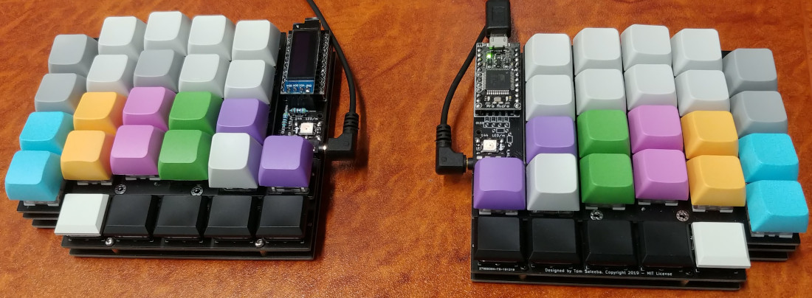
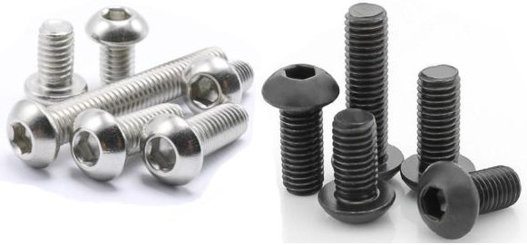

> a columnar stagged keyboard that uses a combination of Cherry MX (or
> compatible) and Kailh choc switches to pack in a heap of thumb keys


## What is this thing?
I've been using an ErgoDox Infinity and an EZ as my daily drivers for quite a
few years now and I love them. I'm looking for something more compact and with
more (easily accessible) thumb keys. There are so many candidates
([here](https://docs.google.com/spreadsheets/d/19-rTWbp8SCKdZFByPZu3RT8NSF8vVddDe8WL6R6b1qQ/edit?usp=sharing),
[here](https://keebfol.io/), [here](https://golem.hu/boards/) and
[here](https://github.com/diimdeep/awesome-split-keyboards)) but none match
*exactly* what I want, so why not build my own!



## Desgin choices:
  - ErgoDox style ortho-columnar but with the extra little finger offset of the
      [Diverge 3](https://unikeyboard.io/product/diverge-3/)
  - Make all thumb keys easily accessible from the normal hand position
  - keys for vim-style arrows on the right hand, and directly below the home row
  - same plate design for both halves
  - compatible with QMK firmware, see [keyboard directory in QMK](https://github.com/qmk/qmk_firmware/tree/master/keyboards/ergoslab)
  - optional top LED for layer status
  - optional underglow LEDs
  - minimise overall footprint by using internal standoffs (thanks for the idea
      [ErgoTravel](https://github.com/jpconstantineau/ErgoTravel))
  - use only 1U key caps to minimise size and because stabilisers are annoying
  - author a single "master" PCB and use a python script to generate the 3
      layers of the sandwich case. Makes life much easier to keep them all in
      sync. (See further down for more info)
  - support 5-pin/PCB mount switches

## Build guide
See the [guide here](./build-guide.md).

## Gerbers
See the [releases](https://github.com/tomsaleeba/ergoslab/releases) for this
GitHub repo for the generated Gerber files. You probably want the most recent
version.

# Parts list
## Parts you'll have to find yourself
  - 2x top PCBs (optional if you're happy with PCB mount; untested)
  - 2x middle PCBs (or 4x as they can also be used as the base)
  - 2x base PCBs (if you didn't order 4x middle)
  - 2x Pro Micros
  - 1x TRRS cable
  - 42x Cherry MX (or compatible) switches
  - 42x [Kailh hotswap PCB sockets](https://novelkeys.xyz/products/kailh-pcb-sockets)
  - 10x Kailh choc switches
  - 42x 1U MX key caps
  - 10x 1U Kailh choc key caps
  - (optional) 2x WS2812 LED from a 144 LEDs/m strip, for layer status lights
  - (optional) more WS2812 LEDs, of any density per meter strip, for underglow
      lighting. 12x is probably a sane number but if you want to run them at
      lower power, you could probably use more.
  - 4x 15mm M2 standoffs (2 per side), for mounting the OLED/ProMicro acrylic cover
  - 8x M2 screws, between 4 and 8mm long, for the above standoffs
  - (optional) 1 or 2 OLED screens
  - 36x M2x4 screw (See Note1 and Note2) for mounting the middle/PCB layer to the base
      plate

**Note1**: the screw/bolt length depends on the height of the standoffs you get. You
want 1.6mm thick PCBs so make sure you don't have *too much* thread on your
screws.

**Note2**:



It's highly recommended to get hex head/allen key/ISO7380 screws. This is
because a phillips head screwdriver probably won't fit through the holes in the
switchplate to tighten the screws on the middle/PCB layer. You can always drill
those holes a bit bigger or loctite the screws in to workaround this. As you
have hotswap sockets, you should be able to remove the switches and pull the
middle/PCB layer screws out through the switch holes.

## Parts available with PCB order
These are the parts you can order from LCSC at the same time as having your PCBs
manufactured. The listed quantity is to assemble *both halves*.

| QTY |  Description                       |  LCSC Part No |
| :---: | :--- | :---: |
|0/2/4| 4.7KO (4701) ±1% (2 per OLED)      |  [C58678](https://lcsc.com/product-detail/Metal-Film-Resistor-TH_4-7KR-4701-1_C58678.html) |
| 2  |  PJ-3200B-4A TRRS Connector         |  [C136687](https://lcsc.com/product-detail/Audio-Video-Connectors_Korean-Hroparts-Elec-PJ-3200B-4A_C136687.html) |
| 2  |  Switch 5.2*5.2*1.5 reset switch    |  [C92584](https://lcsc.com/product-detail/Tactile-Switches_Switch-5-2-5-2-1-5-250gf-Copper-head_C92584.html) |
| 2  |  2.54mm 1*40P round Female header   |  [C9811](https://lcsc.com/product-detail/Female-Header_2-54mm-1-40P-round-Female-header_C9811.html) |
|0/1/2|  OLED Female header                |  [C124413](https://lcsc.com/product-detail/Pin-Header-Female-Header_Ckmtw-Shenzhen-Cankemeng-C124413_C124413.html) |
| 52 |  1N4148 Switching Diode             |  [C14516](https://lcsc.com/product-detail/Switching-Diode_1N4148_C14516.html) |
| 18 |  M2x6mm standoffs (See Note3) for middle/PCB layer to base plate mounting |  [M2x6](https://lcsc.com/product-detail/Studs_Made-in-China-Made-in-China-M2-6-3-5_C193468.html) |

Note3: the standoffs between the middle/PCB layer and the base plate can be
quite small, probably as small as 3mm. The problem with that is making sure the
bolts engage the threads enough. Feel free to experiment with getting a super
slim keyboard. Perhaps use a long bolt, a threadless spacer and a nut? Or only
use one screw per standoff with half from the top and the other half from the
bottom.

# Generating 3 layers of sandwich case
We edit a single PCB file that contains the information required to generate all
3 layer (switch plate, circuitry, base) of a sandwich case keyboard. Keeping it
all in one file ensures that things like mounting hole always stay lined up.

There is some magic in the settings of items on the PCB to indicate what layer
they belong on. Read the code for the specifics but as a general guide:
  - we use Eco1.User as the templates for edge cuts that only appear on some
      layers
  - the width of the drawing lines are slightly different so we can determine
      which belongs on each layer
  - the thickness of text is slightly different so we can determine which
      belongs on each layer

You *must* have Kicad installed in your system. Doing this makes the `pcbnew`
python module available. Make sure you don't have any virtualenv, etc activated
as you need to be using you system-wide python. Check for the module by running
the following in the python REPL:

```python
import pcbnew
```

Now you can regenerate the PCBs with:

```bash
python ./generate_pcbs.py
```

Normally keeping generated things in source control is not a good idea but in
the interest of keeping things easy, we include the generated PCBs.


# Generating gerbers
Using KiCad 5.1.4, here's the settings to generate gerbers.

Plot settings (should be the defaults):
```
Plot format: Gerber
Included layers:
  F.Cu
  B.Cu
  F.Paste
  B.Paste
  F.SilkS
  B.SilkS
  F.Mask
  B.Mask
  Edge.Cuts
Plot foorprint values: yes
Plot footprint references: yes
Exclude PCB edge layer from other layers: yes
Exclude pads from silkscreen: yes
Default line width: 0.1mm
Coordinate format: 4.6, unit mm
```

Drill settings:
```
Drill File Format: Excellon
Mirror Y axis: no
Minimal header: no
PTH and NPTH in single file: no
Oval Holes Drill Mode: Use alternate drill mode
Map File Format: PostScript
Drill Origin: Absolute
Drill Units: Inches
Zeros Format: Suppress leading zeros
```

The fix for the JLCPCB PTH layer error was to change the [oval hole drill
mode](https://forum.kicad.info/t/jlcpcb-gives-me-warnings-on-drill-and-edge-cuts/17565/25).

# Credit for Kicad symbols/footprints
- [Kailh reversible footprints](https://github.com/daprice/keyswitches.pretty/blob/f89ef994a51043281f3fa6dfb4a93d8e4bebdbd1/Kailh_socket_reversible.kicad_mod) ([CC BY-SA](https://github.com/daprice/keyswitches.pretty/blob/f89ef994a51043281f3fa6dfb4a93d8e4bebdbd1/LICENSE.md))
- [P-08073 TACT reset switch footprint](https://github.com/kata0510/minisplit/blob/5fc4b23/minisplit-footprint.pretty/TACT_SWITCH_TVBP06.kicad_mod) ([MIT License](https://github.com/kata0510/minisplit/blob/5fc4b233df8120694ade5a3a812970439e8fc585/LICENSE))
- [symbols: TRRS jack, resistor](https://github.com/MakotoKurauchi/helix/tree/master/PCB/beta) (exported from schematic) ([MIT License](https://github.com/MakotoKurauchi/helix/blob/master/LICENSE))
- [LED symbol](https://github.com/tmk/kicad_lib_tmk) (no license)
- 2.54mm pin headers and diode footprints from built in Kicad library
- [footprints: 4 pin TACT reset, ProMicro, diode](https://github.com/jpconstantineau/ErgoTravel/tree/d443bf4/Library/footprints.pretty) ([MIT License](https://github.com/jpconstantineau/ErgoTravel/blob/master/LICENSE))

## FAQ
**How portable is it?**
It weighs 360grams (180grams for each half) with cheap DSA plastic keycaps. It
measures 115mm x 102mm and with 6mm standoffs, it's 16mm to the top of the
switchplate or 31mm to the top of DSA keycaps, including the height of rubber
bump-ons. I'll let you decide how portable you think that is but it was designed
to be portable.

**Is I2C between the halves supported?**
Sort of. The OLED screens use I2C so you won't be able to use them. Also there's
no solder jumpers so you'll have to jump some wires between the OLED header
SDA/SCL pins and the SLAVE_LED pin/data pin on the unused TRRS jack. This isn't
an intended use but you can certainly hack it, check the schematic for details.

**What happened to a single PCB that works as all 3 layers?**
Originally I tried to make one PCB design that works as all 3 layers of a
sandwich design: base, PCB and switch plate. The idea was taken from
[for-split-keyboard](https://github.com/peej/for-split-keyboard) and
[mitosis](https://www.reddit.com/r/MechanicalKeyboards/comments/66588f/wireless_split_qmk_mitosis/).
I failed because I wanted to have minimal post-manufacture cutting by hand and
JLCPCB kept rejecting my desgins as they didn't have strong enough supports to
hold the PCB together though the whole manufacture process. So now we have
"master" PCB design and use a python script to generate the PCBs for each layer
from that master.

**Do you have keyboard-layout-editor source?**\
Yes. Either [this file](./layout.kle) in this repo or here's a (hopefully up to date)
<a href="http://www.keyboard-layout-editor.com/##@@_x:3&t=#000000%0A%0A#115219;&=E%0A%0A#&_x:9.75&t=#000000%0A%0A#115219%0A#9914a6;&=I%0A%0A*%0A%7D;&@_y:-0.875&x:2&t=#000000%0A%0A#115219;&=W%0A%0A/@&_x:1;&=R%0A%0A$&_x:7.75&t=#000000%0A%0A#115219%0A#9914a6;&=U%0A%0A/&%0A%7B&_x:1&t=#000000%0A%0A#115219;&=O%0A%0A';&@_y:-0.875&x:5;&=T%0A%0A%25&_x:5.75;&=Y%0A%0A%5E;&@_y:-0.625&x:1;&=Q%0A%0A!&_x:13.75;&=P%0A%0A%22;&@_y:-0.625&x:3;&=D%0A%0A3&_x:9.75&t=#000000%0A%0A#115219%0A#9914a6;&=K%0A%0A8%0A);&@_y:-0.875&x:2&t=#000000%0A%0A#115219;&=S%0A%0A2&_x:1;&=F%0A%0A4&_x:7.75&t=#000000%0A%0A#115219%0A#9914a6;&=J%0A%0A7%0A(&_x:1&t=#000000%0A%0A#115219;&=L%0A%0A9;&@_y:-0.875&x:5;&=G%0A%0A5&_x:5.75;&=H%0A%0A6;&@_y:-0.625&x:1;&=A%0A%0A1&_x:13.75;&=/:%0A/;%0A0;&@_y:-0.625&x:3&t=#000000%0A#0b458a%0A#115219;&=C%0A%0A+&_x:9.75&t=#000000%0A%0A#115219%0A#9914a6;&=%3C%0A,%0A%0A%5D;&@_y:-0.875&x:2&t=#000000%0A#0b458a%0A#115219;&=X%0A%0A-&_x:1;&=V%0A%0A/=&_x:7.75&t=#000000%0A%0A#115219%0A#9914a6;&=M%0A%0A~%0A%5B&_x:1&t=#000000;&=%3E%0A.;&@_y:-0.875&x:5&t=#000000%0A%0A#115219;&=B%0A%0A%60&_x:5.75;&=N%0A%0A/:;&@_y:-0.625&x:1&t=#000000%0A#0b458a%0A#115219;&=Z%0A%0A/_&_x:13.75&t=#000000;&=?%0A//;&@_y:-0.625&x:3;&=Del&_x:9.75&t=#000000%0A%0A%0A#9914a6;&=%0A%0A%0A%3E%0A%0A%0A%0A%0A%0A%E2%86%93;&@_y:-0.875&x:2&t=#000000;&=Alt&_x:1;&=GUI%0AEnter&_x:7.75&t=#000000%0A%0A%0A#9914a6;&=%0A%0A%0A%3C%0A%0A%0A%0A%0A%0A%E2%86%90&_x:1&t=#000000&a:7;&=%E2%86%91;&@_y:-0.875&x:5&a:4;&=Shift&=Ctrl&_x:3.75&t=#115219;&=Numb%0AEnter&_t=#000000;&=Space;&@_y:-0.625&x:1;&=Leader&_x:13.75&a:7;&=%E2%86%92;&@_y:-0.375&x:2;&=&_a:4;&=Swap&_t=#000000%0A#0b458a;&=Esc&_t=#ab0202;&=Media&_t=#9914a6;&=Brkt&_x:3.75&t=#000000;&=Tab&=AltTab&=Bspc&=Swap&_a:7;&=">permalink</a>
