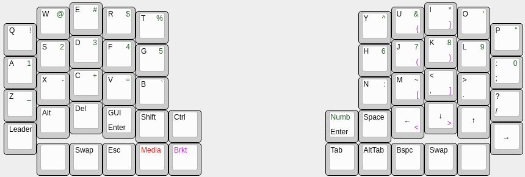

> a columnar stagged keyboard that uses a combination of Cherry MX (or
> compatible) and Kailh choc switches to pack in a heap of thumb keys

**Beware: I haven't built this yet. So I guess it might not work**


## What is this thing?
I've been using an ErgoDox Infinity and an EZ as my daily drivers for quite a
few years now and I love them. I'm looking for something more compact and with
more (easily accessible) thumb keys. There are so many candidates
([here](https://docs.google.com/spreadsheets/d/19-rTWbp8SCKdZFByPZu3RT8NSF8vVddDe8WL6R6b1qQ/edit?usp=sharing),
[here](https://keebfol.io/), [here](https://golem.hu/boards/) and
[here](https://github.com/diimdeep/awesome-split-keyboards)) but none match
*exactly* what I want, so why not build my own!


## Desgin choices:
  - ErgoDox style ortho-columnar but with the extra little finger offset of the
      [Diverge 3](https://unikeyboard.io/product/diverge-3/)
  - Make all thumb keys easily accessible from the normal hand position
  - keys for vim-style arrows on the right hand, and directly below the home row
  - same plate design for both halves
  - compatible with QMK firmware
  - optional top LED for layer status
  - optional underglow LEDs
  - minimise overall footprint by using internal standoffs (thanks for the idea
      [ErgoTravel](https://github.com/jpconstantineau/ErgoTravel))
  - use only 1U key caps to minimise size and because stabilisers are annoying
  - One PCB design that works as all 3 layers of a sandwich design: base, PCB and
    switch plate. Idea taken from
    [for-split-keyboard](https://github.com/peej/for-split-keyboard) and
    [mitosis](https://www.reddit.com/r/MechanicalKeyboards/comments/66588f/wireless_split_qmk_mitosis/)
  - support 5-pin/PCB mount switches

## Gerbers
See the [releases](https://github.com/tomsaleeba/ergoslab/releases) for this
GitHub repo for the generated Gerber files. You probably want the most recent
version.

## Parts list
  - 6x PCBs, as the same design is used for base, PCB and switch plate
  - 2x Pro Micros
  - 1x TRRS cable
  - 42x MX (or compatible) switches
  - 42x Kailh hotswap sockets
  - 10x Kailh choc switches
  - 42x 1U MX key caps
  - 10x 1U Kailh choc key caps
  - (optional) 2x WS2812 LED from a 144 LEDs/m strip, for layer status
  - 8x 4mm M2 standoffs (4 per side), for both mounting the OLED acrylic cover
      and mounting the bottom switch row section of PCB to the base plate
  - 16x 2mm M2 screws (8 per side)
  - (optional) 1 or 2 OLED screens

# Parts
These are the parts you can order from LCSC at the same time as having your PCBs
manufactured. The listed quantity is to assemble *both halves*.

| QTY |  Description                       |  LCSC Part No |
| :---: | :--- | :---: |
|0/2/4| 4.7KO (4701) ±1% (2 per OLED)     |  [C58678](https://lcsc.com/product-detail/Metal-Film-Resistor-TH_4-7KR-4701-1_C58678.html) |
| 2  |  PJ-3200B-4A TRRS Connector         |  [C136687](https://lcsc.com/product-detail/Audio-Video-Connectors_Korean-Hroparts-Elec-PJ-3200B-4A_C136687.html) |
| 2  |  Reset switch                       |  Switch 5.2*5.2*1.5 250gf Copper head [C92584](https://lcsc.com/product-detail/Tactile-Switches_Switch-5-2-5-2-1-5-250gf-Copper-head_C92584.html) or 6*3.3mm [C136742](https://lcsc.com/product-detail/Tactile-Switches_Korean-Hroparts-Elec-K2-1101DT-A4SW-01black_C136742.html) |
| 2  |  2.54mm 1*40P round Female header   |  [C9811](https://lcsc.com/product-detail/Female-Header_2-54mm-1-40P-round-Female-header_C9811.html) |
|0/2 |  OLED Female header                 |  [C124413](https://lcsc.com/product-detail/Pin-Header-Female-Header_Ckmtw-Shenzhen-Cankemeng-C124413_C124413.html) |
| 52 |  1N4148 Switching Diode             |  [C14516](https://lcsc.com/product-detail/Switching-Diode_1N4148_C14516.html) |
| 36 |  M2x4 screw                         |  black [C357533](https://lcsc.com/product-detail/Screw_Shuntian-PM2X4_C357533.html) or silver [C357393](https://lcsc.com/product-detail/Screw_Shuntian-PM2X4_C357393.html) |
| 18 |  standoffs (*see Note1)             |  [M2x3+3](https://lcsc.com/product-detail/Studs_Made-in-China-Made-in-China-M2-3-3_C192879.html) **and** [M2x6](https://lcsc.com/product-detail/Studs_Made-in-China-Made-in-China-M2-6-3-5_C193468.html) (order both!) |

Note1: we need to construct our own M2 standoffs of the right length as they
don't stock M2x9 female-female standoffs.

# Generating gerbers
Using KiCad 5.1.4, here's the settings to generate gerbers.

Plot settings (should be the defaults):
```
Plot format: Gerber
Included layers:
  F.Cu
  B.Cu
  F.Paste
  B.Paste
  F.SilkS
  B.SilkS
  F.Mask
  B.Mask
  Edge.Cuts
Plot foorprint values: yes
Plot footprint references: yes
Exclude PCB edge layer from other layers: yes
Exclude pads from silkscreen: yes
Default line width: 0.1mm
Coordinate format: 4.6, unit mm
```

Drill settings:
```
Drill File Format: Excellon
Oval Holes Drill Mode: Use alternate drill mode
Map File Format: PostScript
Drill Origin: Absolute
Drill Units: Inches
Zeros Format: Suppress leading zeros
```

The fix for the JLCPCB PTH layer error was to change the [oval hole drill
mode](https://forum.kicad.info/t/jlcpcb-gives-me-warnings-on-drill-and-edge-cuts/17565/25).

# Credit for Kicad symbols/footprints
- [Kailh reversible footprints](https://github.com/daprice/keyswitches.pretty/blob/master/Kailh_socket_reversible.kicad_mod)
- [P-08073 TACT reset switch footprint](https://github.com/kata0510/minisplit/tree/master/minisplit-footprint.pretty)
- [symbols: TRRS jack, resistor](https://github.com/MakotoKurauchi/helix/tree/master/PCB/beta) (exported from schematic)
- [LED symbol](https://github.com/tmk/kicad_lib_tmk)
- 2.54mm pin headers and diode footprints from built in Kicad library
- [footprints: 4 pin TACT reset, ProMicro, diode](https://github.com/jpconstantineau/ErgoTravel/tree/master/Library/footprints.pretty)

## FAQ
**Is I2C between the halves supported?**
Sort of. You won't be able to use OLED screens and there's no solder jumpers so
you'll have to jump some wires between the OLED header SDA/SCL pins and the
SLAVE_LED pin/data pin on the unused TRRS jack.

**Do you have keyboard-layout-editor source?**\
Yes. Either [this file](./layout.kle) in this repo or here's a (hopefully up to date)
<a href="http://www.keyboard-layout-editor.com/##@@_x:3&t=#000000%0A%0A#115219;&=E%0A%0A#&_x:9.75&t=#000000%0A%0A#115219%0A#9914a6;&=I%0A%0A*%0A%7D;&@_y:-0.875&x:2&t=#000000%0A%0A#115219;&=W%0A%0A/@&_x:1;&=R%0A%0A$&_x:7.75&t=#000000%0A%0A#115219%0A#9914a6;&=U%0A%0A/&%0A%7B&_x:1&t=#000000%0A%0A#115219;&=O%0A%0A';&@_y:-0.875&x:5;&=T%0A%0A%25&_x:5.75;&=Y%0A%0A%5E;&@_y:-0.625&x:1;&=Q%0A%0A!&_x:13.75;&=P%0A%0A%22;&@_y:-0.625&x:3;&=D%0A%0A3&_x:9.75&t=#000000%0A%0A#115219%0A#9914a6;&=K%0A%0A8%0A);&@_y:-0.875&x:2&t=#000000%0A%0A#115219;&=S%0A%0A2&_x:1;&=F%0A%0A4&_x:7.75&t=#000000%0A%0A#115219%0A#9914a6;&=J%0A%0A7%0A(&_x:1&t=#000000%0A%0A#115219;&=L%0A%0A9;&@_y:-0.875&x:5;&=G%0A%0A5&_x:5.75;&=H%0A%0A6;&@_y:-0.625&x:1;&=A%0A%0A1&_x:13.75;&=/:%0A/;%0A0;&@_y:-0.625&x:3&t=#000000%0A#0b458a%0A#115219;&=C%0A%0A+&_x:9.75&t=#000000%0A%0A#115219%0A#9914a6;&=%3C%0A,%0A%0A%5D;&@_y:-0.875&x:2&t=#000000%0A#0b458a%0A#115219;&=X%0A%0A-&_x:1;&=V%0A%0A/=&_x:7.75&t=#000000%0A%0A#115219%0A#9914a6;&=M%0A%0A~%0A%5B&_x:1&t=#000000;&=%3E%0A.;&@_y:-0.875&x:5&t=#000000%0A%0A#115219;&=B%0A%0A%60&_x:5.75;&=N%0A%0A/:;&@_y:-0.625&x:1&t=#000000%0A#0b458a%0A#115219;&=Z%0A%0A/_&_x:13.75&t=#000000;&=?%0A//;&@_y:-0.625&x:3;&=Del&_x:9.75&t=#000000%0A%0A%0A#9914a6;&=%0A%0A%0A%3E%0A%0A%0A%0A%0A%0A%E2%86%93;&@_y:-0.875&x:2&t=#000000;&=Alt&_x:1;&=GUI%0AEnter&_x:7.75&t=#000000%0A%0A%0A#9914a6;&=%0A%0A%0A%3C%0A%0A%0A%0A%0A%0A%E2%86%90&_x:1&t=#000000&a:7;&=%E2%86%91;&@_y:-0.875&x:5&a:4;&=Shift&=Ctrl&_x:3.75&t=#115219;&=Numb%0AEnter&_t=#000000;&=Space;&@_y:-0.625&x:1;&=Leader&_x:13.75&a:7;&=%E2%86%92;&@_y:-0.375&x:2;&=&_a:4;&=Swap&_t=#000000%0A#0b458a;&=Esc&_t=#ab0202;&=Media&_t=#9914a6;&=Brkt&_x:3.75&t=#000000;&=Tab&=AltTab&=Bspc&=Swap&_a:7;&=">permalink</a>
